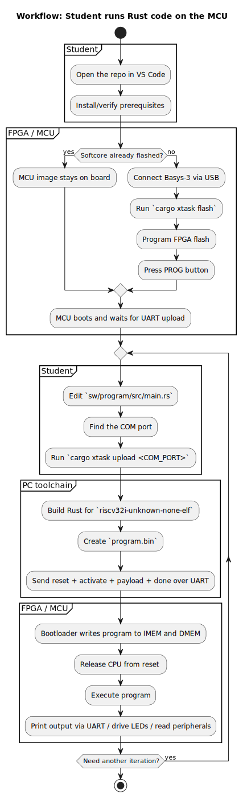
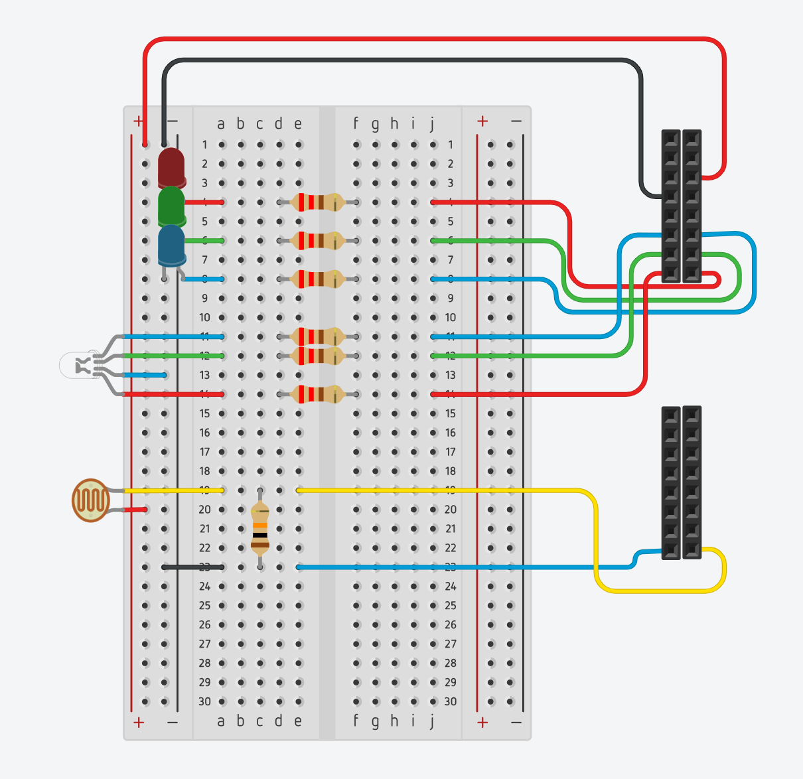

# Manual: SoC for Basys-3 - MCU for embedded systems programming 02112 at DTU
## Introduktion - hvad systemet er og kan
Dette projekt udgør en SoC (System on a Chip) som ved hjælp af implementeringen af en softcore (Wildcat) 3-trins pipelinet RISC-V processor på et Digilent Basys 3 Artix-7 FPGA, muliggør programmering af selvsamme processor og tilhørende periferienheder i Rust. Specifikke GPIO-enheder som LED, knapper, UART og de bidirektionelle PMOD-porte (JA/JB/JC) interageres med via prædefineret Memory-Mapped I/O. For at forenkle systemet er der udviklet et tilhørende abstraktionslag til føromtalte Memory-Mapped I/O, som leverer færdigbagte hjælpefunktioner der forenkler programmeringen af selvsamme.

Med dette system kan du styre LEDs, aflæse knapper, samt sende og modtage data over seriel kommunikation (UART) — alt sammen fra Rust-programmer du selv skriver og uploader til boardet.

Denne manual guider dig igennem opsætning af systemet, forklarer den underliggende arkitektur, og giver dig en komplet reference over de tilgængelige hjælpefunktioner med tilhørende eksempler.

## Begreber og Terminologi **(Anbefalet læsning inden næste sektion)**
### Hvad er en softcore
En normal processor er en fysisk siliciumchip hvor uforanderlige transistorer udgør processorens interne logik. En "softcore" er en processor der er beskrevet i kode og derefter flashet over på en FPGA. FPGA'en bruger konfigurerbare logikblokke, som så kan implementere den logik som koden for softcoren beskriver, og dermed opfører sig som en rigtig processor. Derfor skal man først flashe softcoren som projektet beskriver - det konfigurerer FPGA'en til at være en (for dette projekt's specifikke softcore) Wildcat-processor.

### Hvad er GPIO (General Purpose Input/Output)
GPIO refererer til de fysiske pins på boardet der kan bruges til at sende eller modtage elektriske signaler. En LED tilsluttet en GPIO-pin kan eksempelvis tændes og slukkes af software, eller en knaps input kan aflæses. "General Purpose" betyder at disse pins ikke er funktionsspecifikke, men derimod kan bruges til hvad end du kobler på dem.

### Hvad er PMOD GPIO
PMOD-porte på denne SoC er delt op i tre 8-bit GPIO-banker: JA, JB og JC. Hver bank har fem registre:
- `DIR` til at vælge retning for hver pin
- `OUT` til at skrive output-værdier
- `IN` til at læse de aktuelle pin-niveauer
- `PWM_EN` til at route PWM-signalet til specifikke pins
- `IN_DEBOUNCED` til at læse stabile knap-inputs uden bounce

Det betyder at du både kan styre almindelige digitale signaler og bruge de samme porte til dæmpede outputs, f.eks. en RGB-LED på PMOD-headeren.

### Hvad er Memory-Mapped I/O (MMIO)
RISC-V arkitekturen som Wildcat-processoren er bygget på har kun load/store operationer til at kommunikere med hvad end der eksisterer uden for CPU'en selv. Derfor bruges memory-mapping til at kortlægge specifikke I/O-enheder til specifikke hukommelsesadresser. Når processoren under kørsel af et program skal interagere med forskellige I/O, laver den enten en read eller write operation på en af de specifikke hukommelsesadresser som den specifikke I/O korresponderer med. SoC'en har logik der forstår at for disse specifikke adresser skal den udføre instruktionerne på I/O-enhederne og ikke i den rigtige hukommelse - eksempelvis LED-registret.

### Hvad er HAL (Hardware Abstraction Layer)
For at forenkle programmering af denne SoC er selveste interaktionen med det tilgængelige Memory-Mapped I/O løftet op på et højere abstraktionsniveau. I stedet for at skulle kende de specifikke hukommelsesadresser, er dette et lag af hjælpefunktioner hvor adresserne er hardcodet sammen med den ønskede interaktion i specifikke funktioner. I stedet for at skrive `unsafe { (0xF010_0000 as *mut u32).write_volatile(0xFF) }` kan man skrive `led_write(0xFF)`.

### Hvad er PWM (Pulse Width Modulation)
PWM er en teknik til at styre hvor meget effekt der leveres til en enhed - f.eks. lysstyrken af en LED - ved at tænde og slukke signalet ekstremt hurtigt. I stedet for at sende en "halv" spænding (hvilket kræver analog elektronik), tænder vi LED'en i en vis procentdel af tiden og slukker den resten. Dette forhold kaldes *duty cycle*: 100% = altid tændt (fuld lysstyrke), 50% = tændt halvdelen af tiden (halv lysstyrke), 0% = altid slukket.

Når skiftene sker hurtigt nok (typisk over 100Hz), kan det menneskelige øje ikke skelne de individuelle blink - det opfattes som en jævn dæmpet lysstyrke. På denne SoC kører PWM-tælleren med ~390 kHz, langt over flimre-grænsen, så alle dæmpede LEDs producerer den ønskede bløde og glatte effekt.

PWM-modulet i denne SoC er implementeret direkte i hardware. Det betyder at CPU'en kun skal skrive én duty cycle-værdi per kanal, og så generere hardwaren selv de hurtige skift. CPU'en er demed fri til at lave andet arbejde imens.

### Hvad er en RGB-LED
En RGB-LED er tre separate enkeltfarvede LEDs (rød, grøn, blå) pakket ind i én fysisk komponent. Ved at styre lysstyrken af hver af de tre kanaler uafhængigt - typisk via PWM - kan man vlande farverne og proiducere næsten enhver farve. Denne farveblanding sker i dit øje, ikke i LED'en: når tre lyskilder sidder tæt nok sammen, kan øjet ikke skelne dem individuelt og opdatter dem som ét kombineret lys.

RGB-LEDs findes i to varianter: *common-anode* hvor den fælles pin er +3.3V og hver farvekanal tændes ved at trække den til ground, og *common-cathode* hvor det er omvendt. I common-anode betyder det at en *lav* duty cycle giver *høj* lysstyrke — hvilket HAL-funktionen `rgb_set` tager højde for automatisk.

## Forudsætninger og opsætning
Forudsætningerne for at og flashe projektets softcore arkitektur over på en Basys-3 FPGA for tilsidst at uploade og køre det Rust program der udgør logikken for dit miljø-overvågningssystem er beskrevet i den installationsguide du finder i projektetes `README.md`-fil. 



Herunder en forklaring af hvad hver værktøj bruges til.

### **Forudsætninger:** Værktøjer der skal være installeret
| Værktøj | Formål |
|---|---|
| Vivado | Er Xilinx' udviklingsmiljø til FPGA'er. Det tager SoC-designets hardwarebeskrivelse (genereret Verilog-kode), syntetiserer det ned til en bitstream, og flasher bitstreamen på FPGA'en. Når SoC'en er flashet, ligger den i FPGA'ens non-volatile hukommelse og overlever både genstart og slukning. Du skal kun bruge Vivado én gang — medmindre selve hardwaredesignet ændres. |
| Rust toolchain | Er compileren der oversætter dine Rust-programmer til RISC-V maskinkode. Compileren er konfigureret med target `riscv32i-unknown-none-elf`, som fortæller den at den skal producere kode til en 32-bit RISC-V processor uden operativsystem — præcis hvad Wildcat-processoren er. |

Sørg for at du har installeret overstående ved at følge projektets `README.md`-fil under sektionen **"Prerequisites & Installation"** før du går videre til at flashe SoC'en ned på dit board.

### **Opsætning del 1:** Flash SoC'en på boardet
Efter værktøjerne er installeret og repoet er klonet, skal SoC'en flahes på FPGA'en. Logikken for SoC'en flashes til FPGA'ens non-volatile hukommelse, hvilket sikrer at logikken overlever genstart og slukning af boardet. Det eneste scenarie hvor du ville være nødsagt til at gen-flashe SoC'en er hvis der er blevet lavet ændringer til selveste SoC'ens logik.

**Flash SoC'en ved at**:
1. Tilslut Basys-3 boardet via USB og tænd det
2. I din terminal, naviger til roden af repoet, så du står i mappen `.../rust-riscv-soc`
3. Kør nu kommandoen `cargo xtask flash` i terminalen
4. SoC'en flashes: Vent på at processen færdiggøres (dette kan tage flere minutter)
5. Tryk på PROG-knappen på FPGA (rød knap i øverste højre hjørne af boardet)
6. Efter 5-10 sekunder bør CPU'en køre - den venstre LED lyser som indikation
### **Opsætning del 2:** Upload dit første program
Når først SoC'en er flashet, kan du uploade Rust-programmer (igen og igen) via UART **uden** at skulle reflashe SoC'en over på FPGA'en. Dette er et bevidst designvalg med det formål at sænke den tid det tager at itterere programdesign, og dermed sænke friktion i workflowet for kursister af 02112.

**Upload dit første program ved at:**
1. Find din serielle port:
    - **Windows:** `Get-PnpDevice -Class Ports -PresentOnly`
    - **Linux:** `ls /dev/ttyUSB* /dev/ttyACM*`
2. Upload programmet ved at skrive kommandoen `cargo xtask upload <din_port>` i terminalen
3. Programmet kompilere automatisk, uploades, og begynder at køre. Output fra programmet vises i terminalen.

**Itterer i jeres program design:**
Efterfølgende ændringer i Rust-koden kan uploades ved at køre `cargo xtask upload <din_port>` igen. Det er ikke nødvændigt at reflashe SoC'en for at uplade nye programmer. 

Testkredsløbet herunder er det hardware-setup, som bruges af koden der aktuelt kører i [sw/program/src/main.rs](sw/program/src/main.rs).



## Systemarkitektur - CPU, hukommelse, boot-flow og memory map

### CPU: Wildcat ThreeCats
Projektet implementere en softcore processor på en basys-3 FPGA - den specifikke processor som softcoren implementere er en "Wildcat ThreeCat" CPU, der er bygget på RISC-V arkitekturen og  implementere RV32I instruktionssættet. Det betyder at processorens arkitektur er i et 32-bit format: instruktioner er 32-bit, registre er 32-bit og vi er begrænset til heltalsoperationer (ingen floating point - det kræver højere præcision).

Processoren kører ét clock-tick ad gangen, igennem dens 3 trins pipeline - fetch (hent instruktion fra hukommelse), decode (forstå instruktionen og indlæs registre) og execute (udfør beregningen).
### Hukommelse
SoC'en implementeres i dette projekt med 4 KB scratchpad-hukommelse, som vivado genkender og implementere i den on chip BRAM der findes på et Basys-3 board. 

SoC'en har to seperate fysiske hukommelser - begge implementeret som scratchpad-hukommelse på hhv. 4 KB:
- **IMEM (Instruction Memory):** Herfra henter CPU'en instruktioner
- **DMEM (Data Memory):** Herfra læser og skriver CPU'en data (variabler, stack, arrays osv.)

De to hukommelser er på seperate busser, hvilket betyder at CPU'en kan hente en instruktion og tilgå data på samme clock-cyklus (mere effektivt).

**OBS**: Ved upload routes hvert `(adresse, data)`-word efter adressen. Adresser i `0x0000_0000 – 0x0000_0FFF` skrives kun til IMEM, og adresser i `0x0000_1000 – 0x0000_1FFF` skrives kun til DMEM. Den rå binærfil kan stadig indeholde padding mellem de to områder, men hardwaren gemmer hvert word i den relevante hukommelse. Programmet kan derfor bruge op til 4 KB instruktioner i IMEM og op til 4 KB data/stack i DMEM.

### Boot-flow: Hvad sker der når boardet tændes
**Når boardet tændes, gennemgår systemet følgende sekvens:**
1. **Starter Basys3 m. softcore flashet:** FPGA'en starter med bootloaderen aktiv og CPU'en stallet - den kan ikke eksekvere instruktioner endnu

**Upload-scriptet gennemgår derefter følgende sekvens:**

2. **Reset:** Upload-scriptet sender reset-signalet `0xDEADBEEF` over UART. SoC'en lytter konstant efter 
   denne sekvens og resetter CPU og bootloader til starttilstand (bootloader aktiv, CPU stallet). 
   
   Dette sikrer at systemet er klar til at modtage et nyt program — uanset om boardet lige er tændt, eller om der allerede kører et program fra et tidligere upload.
3. **Aktivering:** Upload-scriptet sender sender magic word `0xB00710AD` som aktiverer bootloaderen.
4. **Upload:** Upload-scriptet sender Rust-programmet som (adresse, data)-par. Bootloaderen modtager hvert word over UART, og SoC-toppen skriver wordet til IMEM eller DMEM ud fra adressen.
5. **Start eksekvering:** Upload scriptet sender done signalet `0xD0000000` som frigiver CPU'en og starter programeksekvering fra adressen `0x0000_0000`.
 
Bootloaderen er implementeret i hardware som en state machine - den er ikke software der kører på CPU'en. Den sidder og lytter på UART-linjen, modtager bytes, og skriver dem ind i hukommelsen.

#### Soft reset
For at muliggøre hurtigere itterationer under developmenmt, er det muligt at re-uploade programmer uden at skulle genflashe hele softcoren. Upload-scriptet sender automatisk reset-signalet `0xDEADBEEF` over UART inden hvert upload. En dedikeret monitor-komponent i SoC'en lytter konstant efter denne sekvens og resetter CPU og bootloader tilbage til boot tilstand når denne detekteres. I overstående sekvens svarer det til at gennemgå punkt 2 - 5 forfra.

### Memory Map: Hvilke komponenter korrespondere til hvilke adresser?
Adresserummet er delt i tre områder: IMEM til instruktioner, DMEM til data og stack, og I/O-enheder ved adresser der starter med `0xF`. For I/O-enheder er det bits 23-20 i adressen der specificerer hvilken enhed der tilgås.
| Adresse | Enhed | Læs/Skriv |
|---|---|---|
| `0x0000_0000 – 0x0000_0FFF` | IMEM: instruction scratchpad (4 KB) | Læs |
| `0x0000_1000 – 0x0000_1FFF` | DMEM: data scratchpad (4 KB) | Læs + Skriv |
| `0xF000_0000` | UART status (bit 0 = TX klar, bit 1 = RX data tilgængelig) | Læs |
| `0xF000_0004` | UART data (læs = modtag byte, skriv = send byte) | Læs + Skriv |
| `0xF010_0000` | LED-register (bit 0–6, 8–15 = LEDs, bit 7 = CPU running indikator) | Skriv (bit 7 read-only) |
| `0xF020_0000` | Debounced button-register (bit 0–3 = btnU, btnL, btnR, btnD) | Læs |
| `0xF030_0000`  | Base address for JXADC analog inputs, offset for four total inputs (e.g. `0xF030_0004`) | Læs |
| `0xF040_0000` | PWM enable-bitmask (bit N = 1 → LED N styres af PWM, bit 7 ignoreres) | Læs + Skriv |
| `0xF040_0004` | PWM duty cycle for LED 0 (8-bit værdi 0-255) | Læs + Skriv |
| `0xF040_0008 – 0xF040_0044` | PWM duty cycle for LED 1-15 (samme format, offset 4 bytes per kanal) | Læs + Skriv |
| `0xF050_0000` | PMOD JA DIR (bit 0–7 = direction per pin) | Læs + Skriv |
| `0xF050_0004` | PMOD JA OUT (bit 0–7 = output value per pin) | Læs + Skriv |
| `0xF050_0008` | PMOD JA IN (bit 0–7 = input value per pin) | Læs |
| `0xF050_000C` | PMOD JA PWM_EN (bit 0–7 = PWM routing per pin) | Læs + Skriv |
| `0xF050_0010` | PMOD JA IN_DEBOUNCED (bit 0–7 = debounced input value per pin) | Læs |
| `0xF060_0000` | PMOD JB DIR / OUT / IN / PWM_EN / IN_DEBOUNCED (samme layout som JA, offset 0x0/0x4/0x8/0xC/0x10) | Læs + Skriv |
| `0xF070_0000` | PMOD JC DIR / OUT / IN / PWM_EN / IN_DEBOUNCED (samme layout som JA, offset 0x0/0x4/0x8/0xC/0x10) | Læs + Skriv |

## Workflow - fra Rust-kode til kørende program
Når du udvikler programmer til denne SoCc, er dit workflow:
1. Skriv eller rediger dit Rust-program i filen `sw/program/src/main.rs`
2. Kør kommandoen `cargo xtask upload <din_port>` fra roden af repoet (`.../rust-riscv-soc`)
3. Dit program kompileres, uploades, og begynder at eksekvere automatisk.

### Hvad sker der på din pc?
Kommandoen `cargo xtask upload` automatiserer følgende kæde af handlinger:
1. **Kompilering:** Cargo (Rusts build-system) kompilerer dit Rust-program til en RISC-V ELF-fil. ELF-formatet indeholder maskinkode plus metadata om programmets struktur (Hvor kode og data starter, symbolnavne osv.)
2. **Konvertering:** `cargo objcopy` konverterer denne ELF-fil til en rå binærfil (`program.bin`). Filen indeholder bytes fra både IMEM- og DMEM-området og kan indeholde padding mellem områderne.
3. **Upload:** rust-craten `uploader` sender binærfilen over USB/UART til FPGA'en. Scriptet håndterer reset, aktivering af bootloader, og overførsel af programdata. Hardwaren bruger adresserne til at skrive instruktioner til IMEM og data til DMEM.
4. **Eksekvering:** Når upload er færdig, frigiver bootloaderen CPU'en og dit progream eksekveres fra adresse `0x0000_0000`.

### Filstruktur

Dit Rust-program skrives i filen `sw/program/src/main.rs`. Det 
er den eneste fil du behøver at redigere under normal brug.

**Note:** Hvis du løber ind i hukommelsesbegrænsninger (4 KB instruktioner eller 4 KB data/stack),
er det muligt at udvide hukommelsen ved at ændre størrelsen i 
`sw/program/linker.ld` og `wildcat/src/main/scala/rvsoc/RustSoCTop.scala`, 
efterfulgt af et `cargo xtask flash`. Kontakt en underviser inden du 
gør dette.

## HAL-reference: tilgængelige funktioner og adresser

Følgende funktioner udgør det Hardware Abstraction Layer (HAL) 
der er tilgængeligt i `main.rs`. Disse funktioner abstraherer 
den underliggende Memory-Mapped I/O, så du ikke behøver at 
arbejde direkte med hukommelsesadresser.

### LED: `led_write(val: u16)`

Skriver en værdi til LED-registret. Hver bit svarer til én LED 
— sæt bit til 1 for at tænde, 0 for at slukke.
```rust
led_write(0b0000_0101); // Tænder LED 0 og LED 2
led_write(0xFF);         // Tænder LED 0-5 + 8-9
led_write(0x00);         // Slukker alle LEDs
```

**Bemærk:** LED 7 er hardwired til CPU running-indikatoren og 
kan ikke styres fra software. Bit 0–6 styrer LED 0–6 på boardet, 
og bit 8–15 styrer LEDs tilsluttet via Pmod-headeren.

### Knapper: `btn_read() -> u32`

Returnerer den debounced tilstand af de fire retningsknapper.
Bit 0–3 svarer til de fire knapper — 1 betyder trykket, 
0 betyder ikke trykket.
```rust
let buttons = btn_read();

if buttons & 0x1 != 0 {
    // Knap 0 (btnU) er trykket
}

if buttons & 0x4 != 0 {
    // Knap 2 (btnR) er trykket
}
```

| Bit | Knap |
|-----|------|
| 0   | btnU (op) |
| 1   | btnL (venstre) |
| 2   | btnR (højre) |
| 3   | btnD (ned) |

### ADC (Analogt Input): `adc_read_all() -> [u32, 4]`

Aflæser den aktuelle digitale værdi fra JXADC-portene på Basys-3 boardet. Spændingen konverteres via ADC-controlleren og returneres som en 12-bit værdi: et heltal mellem 0 og 4095. Dette er især nyttigt til at aflæse analoge sensorer (f.eks. et potentiometer, lyssensor osv.).

```rust
let adc_val = adc_read_all();

if adc_val[0] > 2048 { // Aflæser component i JXADC1, 7
    // Værdien (og dermed spændingen) er over 50%
    println!("ADC-værdi er høj: {}", adc_val[0]);
}
```

### PWM: `pwm_enable(mask: u16)`

Aktiverer PWM-mode for specifikke kanaler i den globale PWM-controller. Hvert bit i `mask` svarer til én kanal — bit 0 = kanal 0, bit 1 = kanal 1, osv. Når en kanal er PWM-enabled, styres dens lysstyrke af dens duty cycle-register i stedet for et almindeligt digitalt output.

```rust
Pmod::JA.set_dir(0b0000_0111); // set JA[1..3] LEDs as output
Pmod::JA.set_pwm_en(0b_0000_0011); // Enable PWM on JA[1..2] pins
```

**Bemærk:** Bit 7 ignoreres af hardwaren, da LED 7 er reserveret til CPU running-indikatoren. Kanaler der *ikke* er PWM-aktiverede opfører sig som normalt og styres af de relevante GPIO- eller LED-registre. For PMOD-pins skal du kombinere denne funktion med `Pmod::X.set_pwm_en(...)`.

### PMOD GPIO: `Pmod::JA`, `Pmod::JB`, `Pmod::JC`

De tre PMOD-porte kan bruges som almindelige GPIO-banker fra Rust. Hver port understøtter retning, output, input og PWM-routing.

```rust
Pmod::JA.set_dir(0b1111_0000);      // Nederste 4 pins som input, øverste 4 som output
Pmod::JA.set_out(0b1010_0000);      // Skriv output på de pins der er sat som output
let input = Pmod::JA.read_in();     // Læs aktuelle niveauer
let stable = Pmod::JA.read_debounced(); // Læs debounced niveauer
Pmod::JA.set_pwm_en(0b0111_0000);   // Route PWM til pins 4-6
```

For PWM-drevne PMOD-pins bruger den tilhørende software typisk `pwm_set(...)` eller en wrapper som `rgb_set(...)` til at vælge duty cycle, mens `set_pwm_en(...)` bestemmer hvilke pins der faktisk lytter på PWM-signalet.

For knapper på PMOD sættes pinnen som input. Alle PMOD GPIO-pins har interne pullups, så en simpel knap kan forbindes mellem PMOD-pinnen og GND. Brug `button_pressed(bit)` for aktiv-lav knaplogik:

```rust
Pmod::JA.set_dir(0b0000_0000); // JA som input

if Pmod::JA.button_pressed(0) {
    println!("JA[0] knap er trykket");
}
```

`read_in()` er raw input og kan bounce. `read_debounced()` og `button_pressed()` er beregnet til knapper.

### PWM: `pwm_set_duty(channel: u8, percent: u8)`

Sætter lysstyrken af en PWM-aktiveret LED som en procentværdi. `channel` er LED-nummeret (0-6 eller 8-15), og `percent` er lysstyrken fra 0 (slukket) til 100 (fuld lysstyrke). Værdier over 100 clampes automatisk til 100.

```rust
pwm_set(0, 100); // JA1: fuld lysstyrke
pwm_set(1, 50);  // JA2: halv lysstyrke
pwm_set(2, 10);  // JA3: svagt lys
pwm_set(3, 0);   // JA4: slukket
```

For at en `pwm_set_duty`-skrivning faktisk påvirker en LED, skal den pågældende kanal være aktiveret via jf. Pmod funktionen `set_pwm_en`. Hvis ikke, gemmes duty cycle-værdien i registret men ignoreres af LED-outputtet.

### RGB-LED: `rgb_set(r: u8, g: u8, b: u8)`

Sætter farven af en RGB-LED tilsluttet PMOD GPIO-pins. Hver farvekanal angives som en procentværdi (0-100). Funktionen inverterer værdierne internt fordi RGB-LED'en er common-anode — så en høj `r`-værdi giver reelt høj rød lysstyrke, som forventet.

```rust
rgb_set(100, 0, 0);   // Fuld rød
rgb_set(0, 100, 0);   // Fuld grøn
rgb_set(0, 0, 100);   // Fuld blå
rgb_set(100, 100, 0); // Gul (rød + grøn)
rgb_set(50, 0, 50);   // Lilla (halv rød + halv blå)
rgb_set(0, 0, 0);     // Slukket
```

**Forudsætning:** PWM skal være aktiveret for de tre relevante PMOD-pins før `rgb_set` virker:

```rust
Pmod::JA.set_pwm_en(0b0111_0000); // Aktiver PWM på de tre RGB-pins
```

### UART: `print!()` og `println!()`

Sender tekst over den serielle forbindelse (UART). Fungerer 
ligesom standard Rust — understøtter formatering med `{}`.
```rust
println!("Hello from Rust!");
println!("Tallet er: {}", 42);
println!("Knapper: 0x{:X}", btn_read());
```

Output kan ses i terminalen efter `cargo xtask upload <din_port>`, eller med et 
serielt terminalprogram (115200 baud, 8N1).

### Avanceret: Direkte MMIO

Hvis du har brug for at tilgå hardware direkte uden HAL-funktioner, 
kan du bruge de rå adresser. Dette kræver `unsafe` blokke i Rust 
fordi compileren ikke kan garantere at adresserne er gyldige.
```rust
// Læs UART status
let status = unsafe { (0xF000_0000 as *const u32).read_volatile() };

// Skriv til LED-register
unsafe { (0xF010_0000 as *mut u32).write_volatile(0xFF) };

// Læs knapper
let buttons = unsafe { (0xF020_0000 as *const u32).read_volatile() };
```

De prædefinerede adresser er:

| Konstant | Adresse | Type | Beskrivelse |
|----------|---------|------|-------------|
| `UART_STATUS` | `0xF000_0000` | `*const u32` | UART statusregister |
| `UART_DATA` | `0xF000_0004` | `*mut u32` | UART data (send/modtag) |
| `LED_REG` | `0xF010_0000` | `*mut u32` | LED-register |
| `BTN_REG` | `0xF020_0000` | `*const u32` | Button-register |
| `ADC_BASE` | `0xF030_0000` | `*const u32` | ADC-base (4 kanaler, offset 0-12) |
| `PWM_BASE` | `0xF040_0000` | `*mut u32` | PWM-base (enable + 16 duty registre) |
| `PMOD_JA_BASE` | `0xF050_0000` | GPIO bank | DIR/OUT/IN/PWM_EN/IN_DEBOUNCED |
| `PMOD_JB_BASE` | `0xF060_0000` | GPIO bank | Samme layout som JA |
| `PMOD_JC_BASE` | `0xF070_0000` | GPIO bank | Samme layout som JA |


## Eksempler på programmering

### Komplet eksempel: Alle periferienheder

Følgende program demonstrerer brug af alle tilgængelige I/O-enheder. 
Ved opstart printes en besked over UART, og derefter kører systemet 
i en uendelig løkke der samtidig:

- Viser ADC-værdien som en bar-graph på onboard LEDs 0-6
- Spejler knaptryk på Pmod LEDs 8, 9, 10
- Fader en RGB-LED på pin 12-14 igennem rød, grøn og blå

```rust
fn main() {
    // Boot-besked over UART
    println!("=== DTU MCU Booted ===");
    println!("SRAM Size: {} bytes", 4096);
    println!("Status: PASS");

    // Aktiver PWM kun for RGB-LED på pin 12-14.
    // Onboard LED 0-6 forbliver almindelig GPIO (on/off).
    pwm_enable((1u16 << 12) | (1u16 << 13) | (1u16 << 14));

    // Fade-tilstand for RGB-test
    let mut fade: u8 = 0;
    let mut fade_up = true;
    let mut color_phase: u8 = 0; // 0 = rød, 1 = grøn, 2 = blå

    loop {
        // 1. Aflæs periferienheder
        let adc_val = adc_read_all();
        let btn_val = btn_read() & 0b111;

        // 2. ADC bar-graph på onboard LEDs 0-6
        let mut adc_leds: u16 = 0;
        if adc_val[0] > 512  { adc_leds |= 0b0000001; }
        if adc_val[0] > 1024 { adc_leds |= 0b0000011; }
        if adc_val[0] > 1536 { adc_leds |= 0b0000111; }
        if adc_val[0] > 2048 { adc_leds |= 0b0001111; }
        if adc_val[0] > 2560 { adc_leds |= 0b0011111; }
        if adc_val[0] > 3072 { adc_leds |= 0b0111111; }
        if adc_val[0] > 3584 { adc_leds |= 0b1111111; }

        // 3. Spejl knapper på Pmod LEDs 8-10
        let btn_leds = (btn_val as u16) << 8;

        // 4. Skriv alle GPIO-styrede LEDs på én gang
        led_write(adc_leds | btn_leds);

        // 5. Fade RGB-LED — én farve ad gangen
        match color_phase {
            0 => rgb_set(fade, 0, 0),
            1 => rgb_set(0, fade, 0),
            _ => rgb_set(0, 0, fade),
        }

        if fade_up {
            if fade >= 100 { fade_up = false; }
            else { fade += 1; }
        } else {
            if fade == 0 {
                fade_up = true;
                color_phase = (color_phase + 1) % 3;
            } else { fade -= 1; }
        }

        // 6. Lille forsinkelse for animation
        for _ in 0..150_000 {
            unsafe { core::arch::asm!("nop"); }
        }
    }
}
```

**Forventet adfærd:**
- Ved opstart vises "=== DTU MCU Booted ===" i terminalen
- Drej på potentiometer tilsluttet JXADC → flere LEDs (0-6) lyser op som en bar-graph
- Tryk btnU → LED 8 lyser, btnL → LED 9, btnR → LED 10
- RGB-LED på pin 12-14 fader langsomt op til fuld rød, ned til slukket, op til fuld grøn, ned, op til fuld blå, ned, og gentager

**Bemærk:** Hvis din RGB-LED er common-cathode i stedet for common-anode, skal 
`rgb_set`-funktionen i `main.rs` ændres så den ikke inverterer værdierne 
(fjern `100 -` foran `r`, `g`, `b`).

## Fejlfinding

### "cargo xtask upload" fejler med "Could not open port"

Seriel porten er enten forkert angivet eller i brug af et 
andet program. Tjek at du har angivet den rigtige port med 
`cargo xtask upload <din_port>`. Luk eventuelle andre programmer 
der bruger porten (serielle terminaler, andre upload-scripts).

### Ingen output i terminalen efter upload

Tjek at din serielle port er korrekt. Tjek at boardet er 
tændt og at SoC'en er flashet (venstre LED skal lyse). 
Prøv at trykke på PROG-knappen og vent 5-10 sekunder 
inden du kører `cargo xtask upload <din_port>` igen.

### Programmet virker ikke efter ændringer i koden

Sørg for at du gemmer filen inden du kører `cargo xtask upload <din_port>`. 
Tjek terminalens output for kompileringsfejl — Rust-compileren 
giver typisk præcise fejlbeskeder med linjenummer.

### "cargo xtask flash" fejler

Tjek følgende:
- **Er Vivado installeret?** Følg installationsguiden i README
- **Kan terminalen finde Vivado?** Vivado skal være tilføjet 
  til dit systems PATH — det er en miljøvariabel der fortæller 
  din terminal hvor den kan finde programmer. Hvis du skriver 
  `vivado -version` i terminalen og får en fejl, er PATH ikke 
  sat korrekt. Se README under "Xilinx Vivado" for hvordan du 
  tilføjer den korrekte sti til PATH for dit operativsystem
- **Er boardet tilsluttet?** Boardet skal være forbundet via 
  USB og tændt
- **Er der kun ét board tilsluttet?** Vivado kan kun 
  auto-detektere ét board ad gangen

### Programmet kompilerer men gør ingenting på boardet

Dit program fylder muligvis mere end den tilgængelige hukommelse. Kør
`rust-size -A target/riscv32i-unknown-none-elf/release/program` fra repo-roden
og tjek at `.text` holder sig under 4096 bytes, og at data-sektionerne samt
stack kan være i DMEM-området.

### LEDs reagerer ikke

Husk at LED 7 er reserveret til CPU running-indikatoren og 
kan ikke styres fra software. Tjek at du bruger de rigtige 
bit-positioner i `led_write()`.

### PWM-aktiverede LEDs lyser ikke, selvom `pwm_set` kaldes

Tjek at `pwm_enable` er kaldt for den pågældende kanal. Duty cycle-værdier skrives til hardware-registrene uanset, men LED-outputtet bruger kun PWM-signalet hvis det tilsvarende enable-bit er sat. Eksempel: For at styre LED 0 med PWM skal bit 0 i `pwm_enable` være 1.

```rust
pwm_enable(0b0000_0000_0000_0001); // Aktiver PWM på LED 0
pwm_set(0, 50);                     // Nu virker denne linje
```

### RGB-LED lyser modsat forventet (høj værdi = mørk)

Din RGB-LED er sandsynligvis *common-cathode* i stedet for *common-anode*. HAL-funktionen `rgb_set` inverterer værdierne som standard fordi den antager common-anode. For en common-cathode LED skal du ændre `rgb_set` i `main.rs` så inverteringen fjernes:

```rust
fn rgb_set(r: u8, g: u8, b: u8) {
    pwm_set(12, r);  // Ingen inversion
    pwm_set(13, g);
    pwm_set(14, b);
}
```

### Almindelige `led_write`-skrivninger virker ikke efter `pwm_enable`

Det er forventet adfærd. Når PWM er aktiveret for en LED, overtager PWM-modulet outputtet og ignorerer det almindelige LED-register for den kanal. For at skifte en LED tilbage til almindelig on/off-mode skal du rydde dens bit i enable-masken.

```rust
pwm_enable(0); // Slå PWM helt fra — alle LEDs tilbage til led_write()
```
