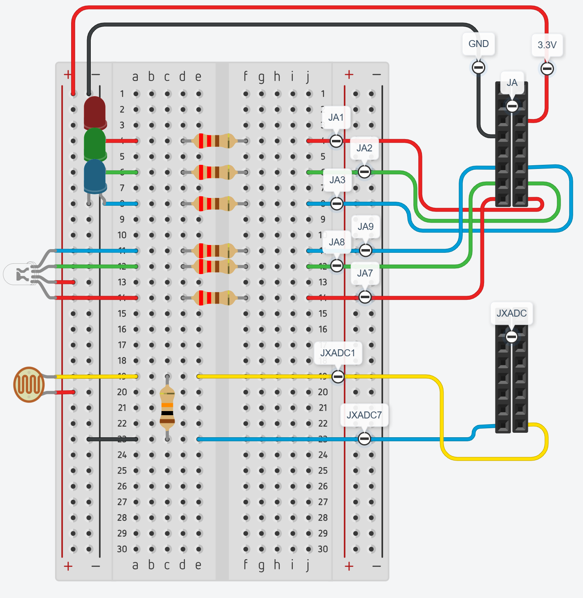
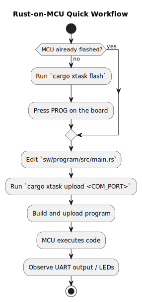

# rust-riscv-soc
Allows you to run rust code on your FPGA through a Wildcat Risc-V.


## :shopping_cart: Prerequisites & Installation

### :rocket: Running Rust on the CPU
_Everything you need to write Rust programs and execute them on the FPGA._

#### 1. Xilinx Vivado (WebPACK Edition) !!Only needed if softcore is not already flashed to board!!
Required for synthesizing the hardware and flashing the FPGA. Only needed once to program the non-volatile flash.

**Check if installed:**
```bash
vivado -version
```
If you see version information, Vivado is already installed and in your PATH — skip to the next tool. If the command is not found, proceed with installation:

- **Download:** Xilinx Unified Installer
- **Install:** Select "Vivado Standard" or "WebPACK" (Free).
- **Important:** During installation, ensure you install the Cable Drivers.
- **System PATH:** After installation, add the Vivado bin folder to your system PATH so the terminal can find the *vivado* command.
    - *Windows:* Add `C:\Xilinx\Vivado\20xx.x\bin` to Environment Variables → Path.
    - *Linux:* Add `source /tools/Xilinx/Vivado/20xx.x/settings64.sh` to your `.bashrc` or `.zshrc`.

#### 2. Rust Toolchain
Required to compile the Rust program that runs on the FPGA.

**Check if installed:**
```bash
rustc --version
cargo --version
```
If both commands show version numbers, Rust is already installed — verify the RISC-V target is added by running `rustc --print sysroot` and search the folder for `riscv32i-unknown-none-elf`. If Rust is not installed, proceed with installation:

- **Install rustup:** [rustup.rs](https://rustup.rs/)
    ```bash
    curl --proto '=https' --tlsv1.2 -sSf https://sh.rustup.rs | sh
    ```
- **Add the RISC-V 32-bit target:**
    ```bash
    rustup target add riscv32i-unknown-none-elf
    ```
- **Install cargo-binutils** (for `cargo objcopy`):
    ```bash
    cargo install cargo-binutils
    rustup component add llvm-tools
    ```

---

### :wrench: Developing on the CPU
_Additional tools needed to modify the CPU hardware (Chisel) and run simulation tests._

#### 3. Java 17+ (JDK)
Required by sbt and the Chisel hardware generator.

**Check if installed:**
```bash
java -version
```
If you see a version number that is 17 or higher (e.g., `17.0.x`, `21.0.x`), Java is installed — skip to the next tool. If not found or version is lower than 17, proceed with installation:

- Windows/Linux: Download from [Adoptium](https://adoptium.net/) (Eclipse Temurin 17+).
- Linux (Ubuntu): ```sudo apt install openjdk-17-jdk```
- Verify: ```java -version```

#### 4. sbt (Scala Build Tool)
Required to compile Chisel (`cargo xtask build-hw`) and run simulation tests (`cargo xtask sim-test`).

**Check if installed:**
```bash
sbt --version
```
If you see a version number, sbt is already installed — skip to the next tool. If not found, proceed with installation:

- All platforms: Follow the install guide at [scala-sbt.org](https://www.scala-sbt.org/download.html).
- Linux (Ubuntu): ```sudo apt install sbt``` (after adding the sbt apt repository).
- Verify: ```sbt --version```

#### 5. RISC-V Assembler/Linker
Required to assemble the simulation test programs (`cargo xtask sim-test`). Not needed for building or flashing the FPGA.

**Check if installed:**

- **Windows (inside WSL):**
    ```bash
    wsl riscv64-linux-gnu-as --version
    ```
- **Linux:**
  ```bash
  riscv64-unknown-elf-as --version  # or
  riscv64-linux-gnu-as --version
  ```
If you see version information, the RISC-V tools are installed — skip to the next section. If not found, proceed with installation:

- **Windows:** WSL (Windows Subsystem for Linux) with the linux-gnu binutils:
    1. Install WSL (from an admin PowerShell): `wsl --install`
    2. Inside WSL: `sudo apt-get install -y make binutils-riscv64-linux-gnu`
- **Linux (Ubuntu 24.04+):** `sudo apt-get install -y binutils-riscv64-linux-gnu`
- **Linux (Ubuntu 22.04 and earlier):** `sudo apt-get install -y gcc-riscv64-unknown-elf`

#### 6. Make (Build Tool)
Required for the legacy `make` workflow and for some older instructions in the project history.

**Check if installed:**
```bash
make --version
```
If you see a version number, Make is already installed. This project now uses `cargo xtask` instead of `make` for the normal workflow, so you only need Make if you are following an older script or comparing against the legacy setup.

- Windows:
    - Option A (Recommended): Install via Chocolatey. Open PowerShell as Admin and run: `choco install make`
    - Option B: Download GnuWin32 Make, install it, and add `C:\Program Files (x86)\GnuWin32\bin` to your PATH.
- Linux:
    - Ubuntu/Debian: `sudo apt install make`
    - Fedora: `sudo dnf install make`

## :rocket: Getting started
After boot, the program prints "PASS" over UART and demonstrates all peripherals:
- **ADC bar-graph:** Onboard LEDs 0-6 light up as a bar-graph based on the first JXADC analaog input
- **Buttons:** btnU, btnL, btnR, light up Pmod LEDs 8, 9, 10 respectively.
- **RGB LED (PWM):** Pmod pins 12-14 drive a common-anode RGB LED that fades through red, green, and blue
- **PMOD GPIO:** JA, JB, and JC are bidirectional GPIO banks. The Rust demo uses the new `Pmod` helper to drive outputs, read inputs, and route PWM to selected pins.
- **I2C (AM2320 sensor):** Pmod JC[2]/[3] form an I2C bus. The Rust demo reads temperature and humidity from an AM2320 sensor every ~2 seconds and prints the values over UART.

**Note:** When CPU is running, LED 7 (leftmost onboard) is lit as a status indicator.

### GPIO overview
The hardware exposes three software-controlled PMOD GPIO banks in addition to the onboard LEDs, buttons, ADC, and I2C controller:
- Each PMOD bank has direction, output, input, and PWM-enable registers.
- Each PMOD bank also has a debounced input register for button-style reads.
- The current Rust program uses JA for button mirroring and RGB PWM output, and JC[2]/JC[3] for I2C communication with an AM2320 temperature/humidity sensor.
- GPIOs can be driven directly from Rust through the MMIO helpers in `sw/program/src/main.rs`.
- PMOD buttons can be wired from a GPIO pin to GND; internal pullups keep the idle state high.
- The I2C controller drives JC[2] (SDA) and JC[3] (SCL); these pins are not available as general-purpose GPIO.

The test circuit below is the hardware setup used by the code currently running in [sw/program/src/main.rs](sw/program/src/main.rs).





### 1. Clone repo (requires git) OR download release zip
```bash
git clone https://github.com/Jfvind/rust-riscv-soc
cd rust-riscv-soc
```
### 2. Flash
Build RustSoCTop.bin from wildcat/src/main/scala/rvsoc/RustSoCTop.scala and flash to Basys3
- **Dependency:** Make sure Basys3 is connected and turned on (And 'Prerequisites & Installation' is completed) and your terminal is in /rust-riscv-soc
```bash
cargo xtask flash
```
- **Duration:** 3 minutes to a lifetime :skull:
- **Output:** 
    - Makes a Vivado project at hw/vivado
    - Generates .jou and .log in root
    - Generates /.Xil in root
- *Note*: it is possible to only build the `.bin` and `.bit` files using `cargo xtask build-hw`, this doesn't flash the FPGA memory.

### :arrow_forward: 3. PROG
Press the red button in top right corner of the Basys3.
After 5-10 seconds the CPU should be running on the FPGA, stored in the non-volatile memory.

### 🔌 4. Upload Rust
**First:** locate the comport you FPGA uses to connect to the pc:
*Windows:* 
```powershell
Get-PnpDevice -Class Ports -PresentOnly | Select-Object -Property FriendlyName
```
Look for something like "USB Serial Port (COM5)". Port name is COM5.

*Linux:*
```bash
ls /dev/ttyUSB* /dev/ttyACM* 2>/dev/null
```
Look for something like /dev/ttyUSB0 or /dev/ttyUSB1.

**Note:** If you don't know which port is your FPGA, then unplug it, run the command, and plug it in again and run the command once more.

**Second:** Upload rust code
```bash
cargo xtask upload <your_COM_port>
```
**Note:** You can re-upload anytime after changing the rust file and then running `cargo xtask upload <your_COM_port>` again.
The bootloader routes uploaded words by address: instructions in `0x0000_0000` - `0x0000_0FFF` go to IMEM, and data in `0x0000_1000` - `0x0000_1FFF` go to DMEM.

### :broom: 5. Clean up (Optional)
Since the CPU is stored in the flash memory, the generated files are not necessary.
**Note:** if making changes to the CPU and the hw/vivado is cleaned away, then `cargo xtask flash` will take longer.

## Changes to schoeberl/wildcat
Static version from feb-2026.

- Added top module instantiating bootloader at src/main/scala/rvsoc.
- Added WSL detection in src/main/scala/Util.scala for running tests in powershell.
- Updated the imported Wildcat repo to work with the local PowerShell-based workflow (SimulatorTest, SingleCycleTest, WildcatTest, WildcatTestUart).
- Added WSL detection in Makefile for binary compilation (riscv64 toolchain).
- Implemented a real 64-bit cycle counter in src/main/scala/wildcat/pipeline/Csr.scala. Previously CYCLE/CYCLEH/TIME/TIMEH returned hardcoded stub values (1/2/3/4); they now return the low/high 32 bits of a counter that increments every clock cycle. This enables precise timing via `rdcycle` from Rust, which is needed for the I2C HAL.
